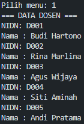

# Hasil laporan kelompok 4 (Case Method 2)

|  | Anggota kelompok & Pembagian Tugas | |
|--|--|--| 
| Mochammad Rijal Dzaki Rifki Afifudin| 244107020240 |  class MataKuliah, case 2, case 5, laporan |
| Sahrul Ramadhani| 244107020058| class Jadwal, class MainSiakad, case 3 |
| Fata Haidar Aly| 24410020108 | class Dosen, case 1, case 4 |

## Case 1
Case 1 di implementasikan pada class Dosen.java, berikut adalah hasil dari case 1 :

## Case 2
Case 2 di implementasikan pada class MataKuliah.java, berikut adalah hasil dari case 2 :

## Case 3
Case 3 di implementasikan pada class Jadwal.java, berikut adalah hasil dari case 3 :

## Case 4
Case 4 di implementasikan pada class MainSiakad.java, berikut adalah hasil dari case 4 :

## Case 5 
Case 5 di implementasikan pada class MainSiakad.java, berikut adalah hasil dari case 5 :

